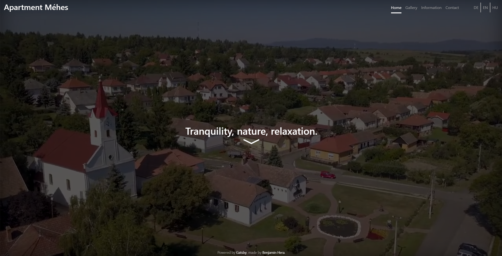

## Installation and usage

Read up on [Gatsby](https://www.gatsbyjs.com/) and play around with [Gatsby's default starter](https://github.com/gatsbyjs/gatsby-starter-default#readme)...

## Features

Basic SEO functionality implemented with [gatsby-plugin-react-helmet](https://www.gatsbyjs.com/plugins/gatsby-plugin-react-helmet/) and [gatsby-plugin-robots-txt](https://www.gatsbyjs.com/plugins/gatsby-plugin-robots-txt/), internationalization implemented with [i18next](https://www.i18next.com/) and other cool basic stuff needed to make this wonderful website.

## Contributions, PRs and issues

are very welcomed because I know jack shit about webdevelopment. The source code is full of unused CSS and bad practices, which should be cleaned up slowly one by one, but it works for now and looks okay so I don't care.

## Plans and future

Acceptable pictures of the property (in/outside); Better layouts for smaller/higher resolutions; If there is a demand, starting a gatsby-starter-apartment-renting repo w/o personal data as a template for others to use.

## License

I don't give a flying flamingo about it, do what ever You feel like with it... Sell it to the Russians or use it to take over the world, 1 important rule tho: I am not responsible for anything.

## Are You in Hungary and want to discover a quiet and relaxing village? (Live Demo)

Check out [mehesapartman.hu](http://mehesapartman.hu/).
